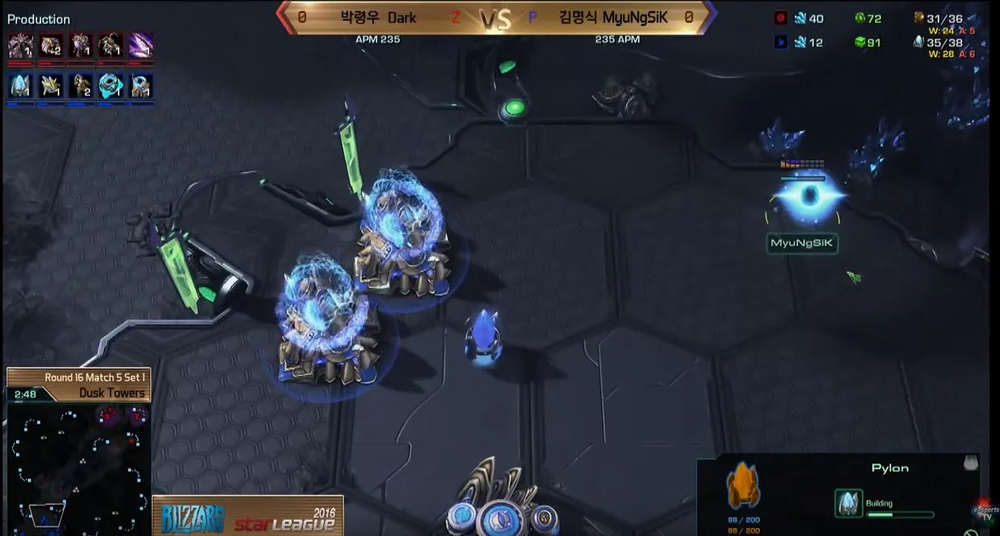
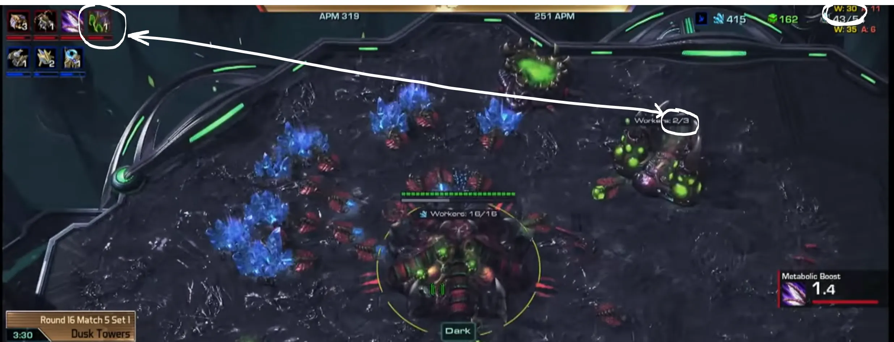
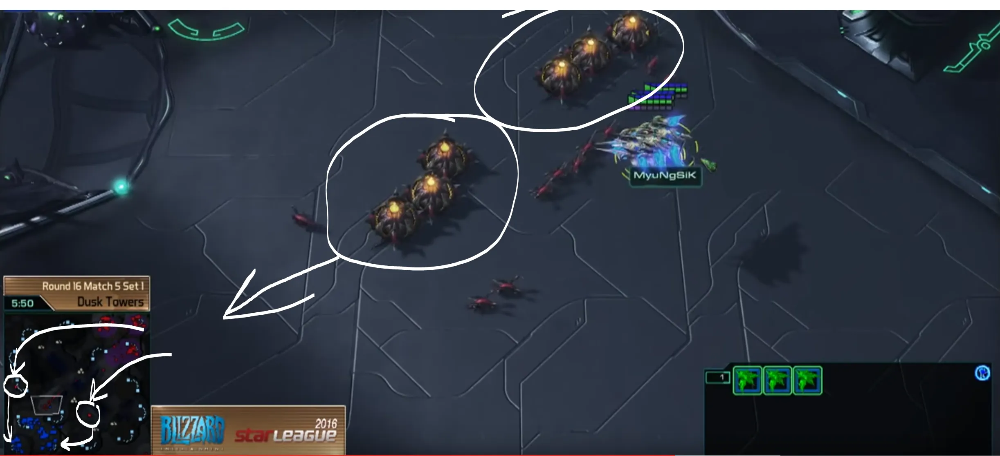

## Summary

Today I wanted to analyze Dark’s ZvP because of how dominant he has been in that match of since the beginning of the year. Dark’s style seems to be all over the place and very random (aggressive) but when you break down his style game by game it really comes together and starts to make more sense as to why he chooses to do what he does. For this section we will be analyzing what seems to be Dark’s standard way of playing vs a normal Oracle/Phoenix Stargate build.

## Dark vs Myungsik @ Dusk Towers

**[YouTube VOD](https://www.youtube.com/watch?v=MS4CkkVJkj0)**

This game, Dark opens with a very standard 3 base opening (not 3 hatch before pool) and this style of play (whether this opening or 3 hatch opening) seems to be his go to standard play when facing against a standard single Stargate opening from Protoss (Oracle or Phoenix):

- 17 Hatchery
- 18 Gas
- 17 Pool
- 19 Hatchery
- 19 Overlord

He follows this up with more and more drones as well as 3 queens (1 per base) and 2 lings to scout and deny any close proxies. If you overlord scout that the opponent is going for 2-Gate adept pressure then these lings can be used for much more than that.

If your opponent opens with the 2-Gate adept pressure (Figure 1) then you can hide your lings from the Protoss player’s vision and use them for a full base scout when they move across the map (~3:00). This is very useful for seeing the follow up after the pressure (usually Stargate for Oracle harass).

What Dark does next is where this build starts to diverge from what we have known to do in ZvP up to this point. After the initial @100 Gas that Dark uses to start:

- Zergling Speed

Instead of taking off 2 or 3 workers like normal, he only removes 1 worker (0 workers if 3 hatch before pool), and continues to mine gas with 2 workers (3 if 3 hatch). With the second @100 Gas mined, he starts:

- Overlord Speed (Pneumatized Carapace)

Which will be vital throughout the rest of the game. He then continues to only mine gas with those 2 workers. Also, at this point in the game you should be around 30 workers and still producing only workers (Figure 2).

When the Overlord Speed upgrade is complete, you as the zerg player have complete control over what you can scout. At this point in the game, Protoss usually has no more than 1 Stalker, if any at all, and cannot deny your Overlord scouting. On this map specifically, you can do a two-pronged scout of the Protoss base from your first two Overlords to ensure you do not miss anything.

At this point in the game, with the Overlord scouting, Dark sees that Myungsik is in fact going for a very standard style (Stargate Phoenix, TwiCo + Robo followup). Another reward about this Overlord Speed is that upon scouting the Pheonix opening, Dark is able to fly his remaining Overlords to safety without any difficulty.

The next turning point in this game is when you hit the 44 drone mark (16 drones + 2 on gas, 16 drones, 10 drones, between the three bases) which happens to be around the 4:10 mark

- Roach Warren + 3 additional gas geysers + 3 drones on the original gas + ~4 Overlords

After hitting precisely 50 drones Dark completely cuts his drone production and goes for a timing attack on the third base of the Protoss. Dark starts to build an:

- Evolution Chamber
- 10 Roaches
- Mass Speedlings

Dark now utilizes the Overlord speed and commits to a 3-pronged attack on every base of the Protoss. Morph in the 8–10 Roaches into Ravagers outside of the Protoss’s third base, Dark is also loading 2 Overlord drops to attack the main and natural mineral line of Myungsik (Figure 3).

At most levels in Starcraft this attack will outright win you the game, but in the case of Dark he doesn’t quite kill Myungsik with this attack. While attacking Dark is following up immediately with Lair tech and drones to saturate the third base completely. During the attack you will want to focus on the mineral lines with the Zergling drops and then use the Corosive Biles to zone the Protoss army and try to snipe the 3rd base (and probes).

What you should be cautious of when executing this strategy:

- Don’t get caught off guard by the Oracle opening. This build is reliant on a very specific timing and a specific number of Drones so if you lose any it will put you quite behind and you may need to follow up with a different strategy.

- After the attack (assuming you do not completely wipe out his army) be prepared for a followup attack with mass adepts. One way to deal with this is to leave units (Roaches/Hydras) in each mineral line when the protoss goes to counter. Luckily for Dark, while he did take massive damage from the counter attack, he was able to counter attack again and win.

- Depending on the unit composition of the Protoss player and how much damage you caused, you can choose whether to follow up with Mutas, Lurker/Hydra, or tier 3.

- If not much damage was taken by the Protoss player, one successful followup I have seen is to take your fourth base, saturate with 70-ish drones and turtle with spore/Lurker while quickly teching to Brood Lord and then slow push the Protoss player with Brood/Lurker/Corrupter.

---

_[This blog was originally published under my Medium account](https://medium.com/keevan-dance-starcraft/dark-s-zerg-vs-protoss-6b82e3249528)_
