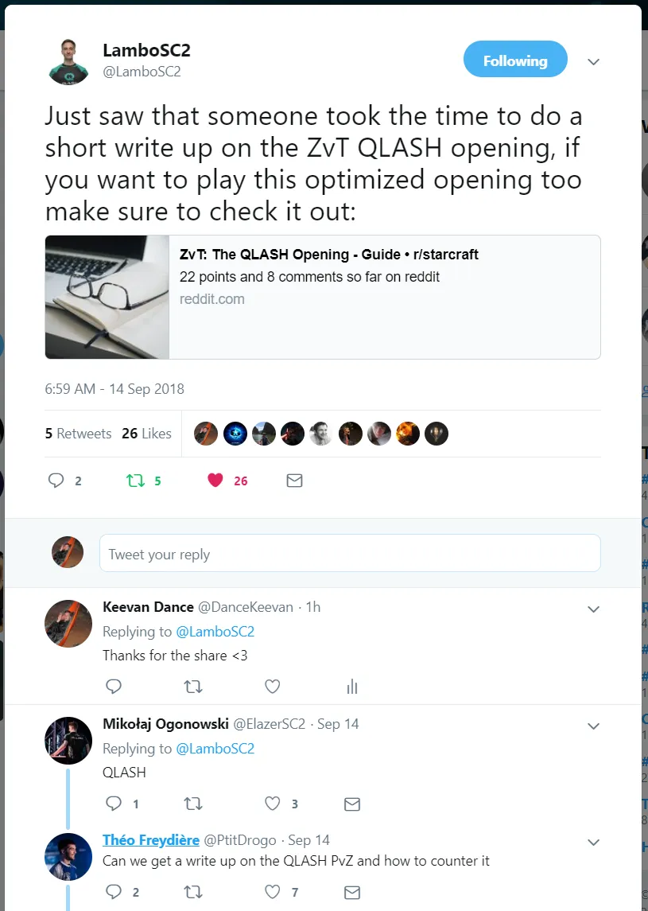

## Summary

This is a follow up to the [first post](https://keevandance.com/posts/zvt-the-qlash-opening) in this series of QLASH openings. Also be sure to check out the Scouting and Reactions in ZvT guide published recently.

First off, a huge thanks to Lambo for sharing the last guide and a huge thanks to PtitDrogo for inspiring this post ❤

First disclaimer: this is the “Lambo Edition” because after analyzing Elazer and Lambo games, it seems that their openings are different in very subtle ways. I chose to do Lambo’s opening because I think it is a bit of a safer opening as opposed to Elazer’s opening.

For those interested, the main differences in the openings:

Elazer takes an extra drone instead of 3rd Overlord only leaving him room for 1 set of lings when his pool finishes (I think this may be a bit greedy for most players to execute when they are pylon blocked at the third quite often)
Elazer takes a 32 Hatchery
The strategies analyzed in this post are directly from the games from Lambo at Montreal 2018.

## Part 1: The normal stuff

- Game Start — Rally the first Overlord to Protoss’ natural

This Overlord is very important as it will be your entire early-mid game scout.

- 13 Overlord — Rally to natural, and then position just slightly in front of natural

The 2nd Overlord should be used to scout for Cannon Rushes. By sending it to the natural expansion, you should be able to see if there is a probe going for the cannon rush behind the minerals. If you do not see anything, start to move the Overlord more in front of the natural to see if there is any Pylon or Cannon building further away.

- 16 Hatchery (15 on smaller maps like Blueshift and Fracture)

The reason for the Hatchery timing in this guide is primarily to prevent Pylon blocks. It is all too common for Protoss to scout after Pylon which will generally block the 17 Hatch (16 on the maps listed above).

- 3 Drones — Rally the first to minerals, the second to Gas, the third to build the Spawning Pool

- 18 Gas (with rallied drone)

- 17 Spawning Pool (with rallied drone)

- 4 Drones — Rally first three to Gas Geyser, last one to natural

## Part 2: Taking Your Third and Initial Scout

- 20 Overlord

- @ 100% Pool 2 Queens + 4 Lings (2 sets of Lings)

Use the first 4 Lings to deny Probe or Pylon blocking at the natural. If possible, you would want to get the surround on the Probe to deny it from returning home safely, sometimes this is not possible though, depends on the level of play.

- 4 Drones — Rally 28th Drone from the natural to the third base

- @ 2:10 (28/36) Check your first Overlord at Protoss’ Natural

You want to check to see if Warpgate starts immediately on the Cybernetics Core. If Warpgate starts almost immediately after the Cybernetics Core finishes, all it means is that it is not a super quick Stargate. If Warpgate doesn’t start until ~2:25, then that means it is most likely a quick Stargate before Warpgate.

- @ 100 Gas — Speed and take two drones off gas

Leaving the one drone on gas does not affect mineral income too much and will allow you to have a quicker 100 gas after speed which will definitely come in handy vs certain builds.

- @ 2:30 Check Protoss’ first unit

If the Protoss player opens with an Adept first, just continue with the build as described. If they open with a Stalker, you may want to cancel Zergling speed and quickly start Overlord speed. Since the Stalker will be able to deny your Overlord scout at 3:00, if you want to guarantee the scout, this is a wise move

- 30 Hatchery + double inject with Queens

After taking your third, it may be wise to send a single Zergling around the outskirts of the map (dodging the Adept) in order to scout possible proxy locations and then third base location for the Protoss

## Part 3: Advancing into the Mid Game

- 32 Overlord + Queen at natural

- Burst of Drones from first injects — put two drones back on gas

- @ 3:00 send Overlord into Protoss’ main base for scout

If there is no Stalker, you want to send this Overlord in to confirm the Protoss’ first tech structure and which will determine how you begin to move into the mid game. Also, after scouting the first tech, if possible, you will want to double back and try to scout the timing on the Protoss’ natural gases, as this will usually determine the follow up to their initial tech choice.

- Use Queen at natural to place Creep Tumor to connect the natural to the third base

… From here it is all dependent on what you scout.

- spores vs Stargate
- Roach Warren and second gas for Twilight or Robo
- Roach Warren and stop all droning in favor of units almost no gas is mining in main and a Twilight researching.
