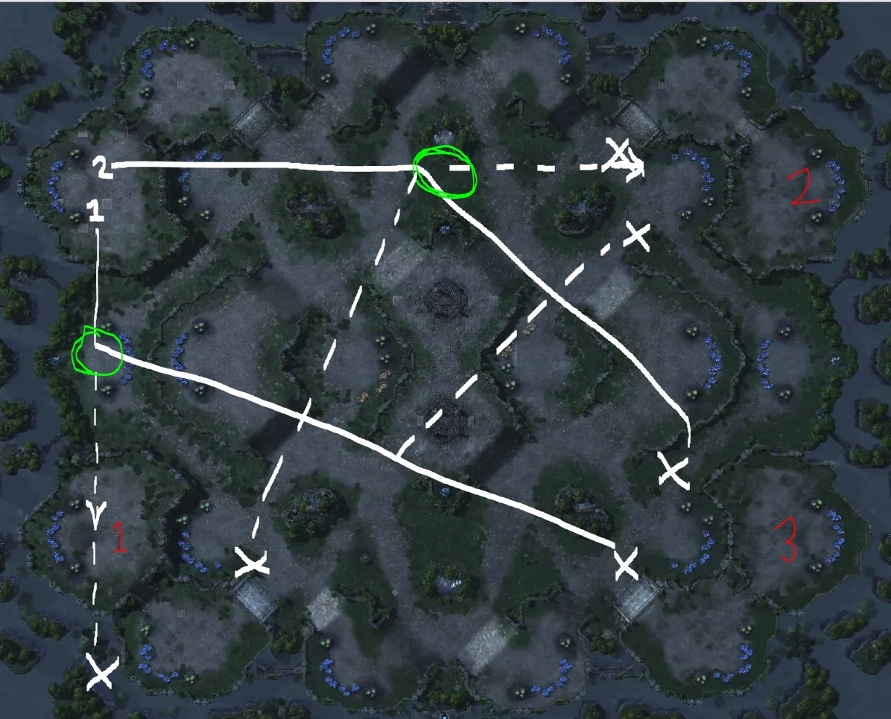

## Summary

In this entry, I plan on writing about some of the ways I think you could be improving your early game. This will include scout patterns (based on my opinion and watching pro replays) and little intricacies that you may not notice when watching some players on GSL. This will make your early game much better and will allow you to create habits for yourself so your early game becomes must more consistent which will in turn allow you to position yourself well for the midgame.

## The Build Order

For my standard opening, I have been watching some of the top korean games we see in ProLeague, the SSL, and the GSL in order to find common trends in how they are opening. There is a somewhat popular pool first build (in both ZvT and ZvZ) that some pros are utilizing as an extremely safe (early speed) option, but for this I will be sticking with the Hatchery first build. Here are the specifics of the opening:

- 13 Overlord

You will use this Overlord (on 2-Player maps) to be a followup scouting overlord generally scouting for proxies (ZvT) or alternate rushing paths (ZvZ) that your first overlord may not see. You will see specifics of this in the Overlord Scouting section.

- 17 Hatchery

You will rally your 15th drone to build the Hatchery. This will usually not be the biggest deal, but it really flows with this build and doesn’t require you to interrupt a drone that may already be mining (Figure 1). When your 16th and 17th drone pop they should be rallied to the only two mineral patches that do not have a full two-drone saturation (Figure 1).

- 18 Gas

You will rally your new 17th drone (since you lost one drone to the hatchery) to an empty gas geyser (Figure 2). One tip would be to rally it to the furthest gas geyser from your ramp as to cause the reaper to have to commit more when he enters your base to scout for the gas timing.

- 17 Spawning Pool

You will rally the 18th drone (the one right after building the gas drone) to an empty place around your base to build your pool (Figure 2). Usually you do not want to place this structure near the edge of your base (because of potential drops later in the game) and you do not want to put it behind your mineral line (poor placement could block you from attacking liberators later in the game).

- Drones 17, 18, 19

If you want the easy way out, you can just rally all three of these drones from the eggs to the gas so that when the geyser completes, these drones will be very close to popping. However, if you want to be more advanced, since the 19th drone will be slightly delayed, you can rally that drone to the mineral patch nearest the gas geyser and then take a drone off of that mineral patch to fill the gas geyser (this will get you a quicker speed by 1–2 seconds) (Figure 3).

- 19 Overlord

With this overlord you will usually place it (depending on the map) at the ramp between your natural and their base. The reasoning is to scout for an incoming reaper in ZvT or Banelings in ZvZ. This will give you a couple extra seconds to see both of these coming so you have a little more time to prepare. Figure 4 is an example of what I am talking about on Dusk Towers.

From here I generally grab my 2 Queens and 0–4 Lings depending on what I scout in either match up. Using that third overlord, sometimes you can guess which part of the cliff a reaper may come up and this will allow you time to position your Zerglings in a way that will hopefully surround the Reaper when he hops up the cliff.

## Overlord Scouting

For this section I think it is best that I do a brief description of what you are trying to accomplish with the first two Overlord scouts in each match up and then I will show you some examples of how to do this.

### ZvT

For Zerg vs Terran on most maps you are safe to send your Overlord across the map with both Overlords and not really having to worry about much. There are some sneaky tricks you can do to maximize your scouting potential and I will show you that on the specific maps.

#### Ruins of Seras:

On this map I send the first Overlord to the close air position (behind the mineral line) in order to scout for the opponent. The reason I send this Overlord behind the mineral line instead of right to their base is so that there is a potential (assuming they spawned there) that I will scout them without them scouting me. The reason this is so beneficial is because without knowing where I am right away, they must sacrifice the mining time of sending an SCV to scout me or just relying on a reaper. If they rely on the reaper, it is almost guaranteed that I will not be scouted first so I do not have to worry about them harassing me or disrupting my mining with the reaper and as long as I have my queens/lings in a good position I do not have to worry about them scouting my gas timing either.

With this Overlord I will click on the mineral (as shown in Figure 5) and that will tell me if they have spawned there. If they spawn there, I will continue flying my Overlord around the back of their mineral line to the back of their natural where I can scout if they have expanded yet all while keeping Terran in the dark as to where I am located.
The second Overlord (seen in the minimap) will head straight to the close land position land. You need to make sure that you are watching it so you can turn it around at the first sight of a CC (assuming they spawn there). If you are not careful as to catch it immediately it may be prone to being sniped by a couple of Marines when it arrives.

#### Dusk Towers:

As shown in the next image you will see red circles and green circles

**Green Circle:**
This is where you will possibly see a Reaper if they have opened with a standard Reaper expand, if you do not see a reaper continue on the path toward the third base as they may be coming to snipe your Overlord with a marine soon.

**Red Circles:**
These (for me) seem to be the common proxy locations for Barrax (Reaper/Marine). This Overlord will be used to scout for these proxies so you are not surprised when you have 4 Reapers showing up unannounced.

#### Orbital Shipyard:

This map is almost identical in Overlord scouting to Dusk Towers. You will send your first Overlord towards their main and pivot off towards the side of their natural (air space). The second Overlord will head towards your unnatural 4th base (the further one) to scout for proxies, and then it will pivot towards the destructible rocks near the third (scout the main base later, or used to scout third timing).

#### Prion Terrace:

**Red Line**
This represents and alternate path. If you send the second Overlord towards the alternate path, then the first Overlord, too, follows the alternate path.

**Green Circle**
Common locations for proxies, and what areas you will need to pay attention to (CC timing, Rax at front of ramp, etc…).

#### Ulrena:

Ulrena is pretty straight forward and I probably do not need a picture to describe this one.

First Overlord will go straight into their base, specifically in between the ramp to the main and the CC placement. You will use this Overlord to look for gases (1 gas, 2 gas, no gas) and number of Barracks. Next you will send this overlord into the airspace behind their natural expansion to check for the CC timing. If you see that they added on a add-on to their Barracks, then it is possible to poke in quite a bit with this overlord to check factory follow up and other things.

Second Overlord will go to the ramp of your natural and then follow down near the watch tower. This is useful to check for really greedy proxy Barracks that they could possibly place at the front of the ramp to your natural. This Overlord will then hug the strip of land where the watch tower is and will sit at the elbow (airspace) between the natural ramp and chokepoint on the Terran side of the map. This position is useful for seeing units moving out early on for timing attacks or all ins.

#### Central Protocol:

The first Overlord follows the same technique as the first Overlord on Ruins of Seras.

Second Overlord. Good luck. No, but I generally park it at the ramp to my natural since this is a weird map that usually results in odd reaper openings and since the spawn locations changed, I will know where he spawns with the first Overlord no matter what.

#### Lerilak Crest:

Since I cannot find a good image of this map I will do my best to describe the Overlord scouting.

First Overlord will go towards the close land position (their third is close to your natural). Your goal is to send this Overlord in between the ramp to their main and the CC in their main. Ideally, once you see the enemies base or Barracks you turn completely around and sit at their third base so you can poke in to scout later. This would not let them see your Overlord and put you in a similar position as on Ruins of Seras.

Second Overlord will head to the back of the mineral line of the close by air position (exactly the same as the first Overlord on Ruins of Seras). Usually you will be able to see the CC started and then you can pull back without their knowledge. Poking in too far could result in a loss of that Overlord.

### ZvZ

The most common things you will want with the first Overlord is to scout lings leaving the base and then position it to poke in to scout Lair/Gas timings later. For the second Overlord, you will generally use this to scout an alternate rush position early on and then park it right outside of their ramp so you can see any units that will leave their base. One of the most important things in knowing if a cheese is coming in ZvZ is if you see their second Overlord with your First Overlord as you get closer to the opponents base (2 player maps).

#### Ruins of Seras:

Ruins of Seras in ZvZ is probably the most confusing map to Overlord scout as well as the most tedious. When looking at Figure 8 you will see that there is a White Solid Line, a White Dotted Line, Green Circles, and Red Numbers.

**Red Numbers**
The Red Numbers stand for the different spawning locations assuming you are spawning in the top left position.

**White Line (Dotted and Solid)**
The White line is the Overlord travel path. Assuming the opponent will spawn in Location 3, the solid lines are the default travel path. If they were to spawn in the other locations you can follow the alternate paths (the dotted lines).

**Green Circles**
The Green Circles are what you are going to pay attention to with your Overlords. This will be imperative in deciding whether to continue down that specific path or if you need to change to an alternate path.

Your First Overlord will immediately head straight for the close air position. Upon entering the middle of that base (where the green circle is) you are going to be looking for the opponents Overlord. If you see the opponents Overlord then you will continue heading toward that base and eventually stop behind their mineral line at the natural (where you can count the drones) and you will redirect your second Overlord towards the third base of the opponent eventually stopping it outside their natural expansion. If you do not see the opponents Overlord at this time, it is safe to say that they did not spawn in that location and you can pivot the first Overlord towards the 3rd spawn location (cross spawn).

The Second Overlord will head directly to the close land spawn (Spawn 2). If you do not see the first Overlord with your first Overlord then they must spawn at either 2 or 3 at this point. With the second Overlord you are looking to see if you see an Overlord where the green circle is. If you see an Overlord at the green circle when you arrive to the green circle, you can safely assume that this is their second Overlord and they have spawned in the Spawn Location 2. You will then pivot the first Overlord (which should be headed to Spawn Location 3) towards the base of the opponent. If you do not see the Overlord in the green circle this can mean two different things:

1. They have spawned at number 2 and are just cheesing you (somewhat rare on this map considering the size).

2. They have spawned at number 3 and you can pivot your second Overlord early in order to get to their base faster. This
   option is a little riskier if in fact they are cheesing you and you do not see it coming.

#### Dusk Towers:

This map is much simpler compared to Ruins of Seras. Remember the tip mentioned in the introduction: If you know the normal timing for when your first Overlord should see their second Overlord you can determine right away if they are cheesing you or not (most of the time). What is neat about the second Overlord scouting on this map as well as many others, is you do not allow them to follow this same thinking, since they will not see your second Overlord. This works both ways, but alternate scout paths for the second Overlord do not seem too common in Masters or GM on NA.

The First Overlord will head straight for the opponents base. The first green circle will be when you are starting to look for incoming lings that the opponent is not trying to hide. Also not too long after the green circle keep an eye out for the second Overlord. Seeing the second Overlord immediately tells you that this is not a cheese build. You will then use the first Overlord to check for creep at the natural telling you if they have expanded and then will park behind the third base in order to scout the third base timing.

The Second Overlord will be used to scout for the more commonly used 13/12 Baneling Speedling build where you hide the Zerglings until speed finishes and you try and catch the opponent off guard. This green circle is generally where the opponent will send the hidden Zerglings to dodge the Overlord Scout pattern. By following this scout path you can see this rush coming from a mile away.

#### Orbital Shipyard:

The First Overlord follows the exact same path as on Dusk Towers. It will head towards the ramp to scout potential oncoming Zerglings (or the second Overlord). Next you will wrap around the airspace towards the natural to check for creep there.

The Second Overlord can either:

1. Head straight for the ramp at the opponents third base

2. Head towards the small airspace in the middle of the map right next to your natural 4th base and then towards the opponents 3rd base ramp

3. Head towards your un-natural 4th base and then towards your opponents 3rd base ramp.
   Options 2 & 3 attempt to do what we are doing with the second Overlord on Dusk Towers while option 1 attempts to get quickly to the third of the opponent in case they take a very quick third base (which is common on this map in ZvZ).

#### Prion Terraces:

The First Overlord will head straight for the opponents natural expansion because you want to see if they are taking the gold base right away. Also look out for incoming Zerglings around the halfway mark on the map as well as the second Overlord.

The Second Overlord will do exactly what it did on Orbital Shipyard. You can send this towards your 3rd Base (Gold Expansion) or towards the Watch Tower. Both of these routes attempt to see Zerglings the opponent may try to hide for a 13/12 build.

#### Lerilak Crest:

This is kind of a confusing map similar to Ruins of Seras.

**Opponent spawns at Location 2:**

You will know they spawn at this location when you either see the Hatchery at the natural or you see Zerglings running towards your base. If you see either of those, you send your second Overlord immediately to the outside of this base, and send the Overlord to the third (If they already expanded) or behind the natural (if they are cheesing).

**Opponent spawns at Location 1**

This is the worst case scenario because it will be difficult to tell if they are cheesing or not. After seeing no natural or Zerglings from your first Overlord you will position it towards that base. Since they must be at spawn location 1 or 3 now. Once you know they have spawned here, redirect the second Overlord towards their third base so you can see the timing of that base. The first Overlord will position outside of the natural to watch for units moving out.

**Opponent spawns at Location 3**

You might know if they spawn here immediately when/if you see their Overlord at the first green circle with your second Overlord. If you see this Overlord send your second Overlord in between the ramp at the natural and the ramp at their third. This allows you to see whether units are headed towards you before your first Overlord can get into position. Once your first Overlord arrives, you can position your second Overlord at the third of the opponent.

---

If you have made it this far, thank you. Maybe I should have seperated this into two seperate guides, but I figured that both of these topics were related to the overall idea of the guide.
_[This blog was originally published under my Medium account](https://medium.com/keevan-dance-starcraft/dark-s-zerg-vs-protoss-6b82e3249528)_
