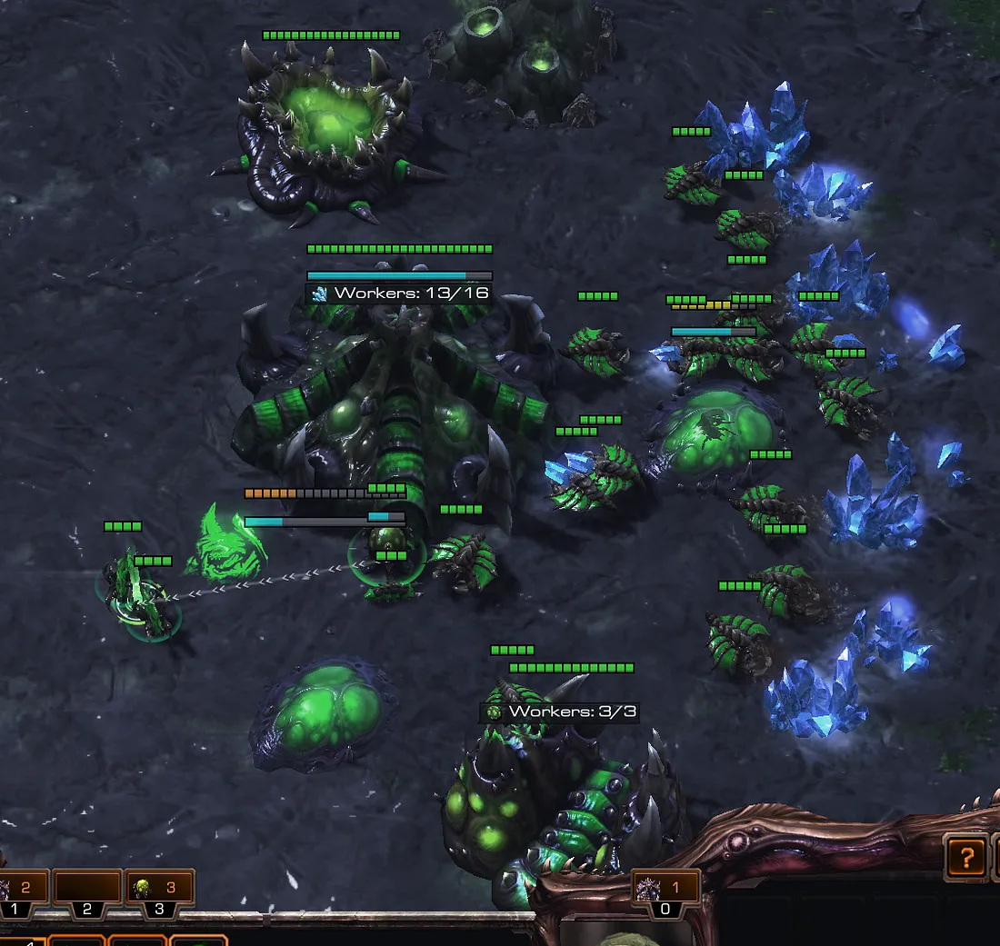

## Summary

In ZvZ, even at the pro level, we see various forms of cheese. Whether that is 14/14 Speed/Bane, 14/14 Delayed Speed/Bane, 12 Pool, or any other forms of cheese, there is a pretty standard opening that you can do to ensure that you are as safe as possible against various forms of cheese. In this guide we will cover what little things you can do that may make or break your anti-cheese defense!

NOTE: This guide is NOT going to be map specific as most maps are going to be changing from season to season. So for example, some of these strategies may or may not work on maps like Ulrena because of the extremely short rush distance so keep in mind that while these strategies and tactics may not work on outlier maps, it will work on most maps in a rotating map pool.

Throughout this guide, we are going to assume that you are opening with a standard 17 Hatch, 18 Gas, 17 Pool.

Prior to learning how to defend the builds here are some things you should be doing anyway!

## Pool Location

You should ALWAYS place your pool in a way that gives you 1 block to place your Queen while making sure there is no gap between the pool and the gas geyser. Also, you should be placing your pool at the gas closest to the ramp so you are blocking the closest access to your mineral line.

## Gas Location

While this is not set in stone and can maybe be argued either way, I prefer to place my Gas Geyser at the gas opposite the Pool and the ramp. I think it is safer as your drones tend to bunch up near the gas and the minerals closest to the gas, so I feel that it is safer keeping that away from the ramp.

## The Infamous 14/14 or 14/13 Speed/Bane All-in

### Scouting

Like with many other pool first builds, there are little things you can do to give you the best chance to see these builds coming as soon as possible. Overlord scouting is a BIG giveaway sometimes. Especially at lower levels (< GM) you are hardly ever going to see players alter from the standard ‘sending their Overlords straight to your base’ tactic. Assuming the player is following this tactic the timing of the second Overlord or whether you see the second Overlord at all can be an immediate giveaway that there is some sort of cheese coming. To see exactly what I am talking about check out my Overlord scouting guide here and scroll down the page.

Alright. I see the Lings at my base or I have seen the Lings leave the opponents base, how do I know that this is NOT a 12 Pool expand? Well, you need to COUNT the number of Lings that are at your base or leaving your opponents base. First of all, if you see the Lings as they are leaving the opponents base, and you see them leaving at ~1:40 give or take a couple seconds, that is 100% a 14Gas 13Pool build (~1:45 for 14/14) and you can be SURE that there is probably some speed and/or banes coming and can prepare accordingly. Unfortunately, you will not always see the Lings as they leave the base (4 player maps) and you will have to rely on counting and a little luck.

If you do NOT see the Lings as they exit the opponents base and don’t see them until they arrive, you need to count as they attack the Hatchery. If you see more than 8 Lings, you can almost guarantee that this is a heavy pressure and not a simple expand build. Sometimes the opponent will hide the Lings that he will transform into Banelings so you may only see 6 Lings. I recommend placing your third Overlord just outside your natural ramp (on most maps. If there is an in base natural, just place it a little outside your main base) and this will help you either scout the Lings as they are morphing, or you will scout the Banelings in time to pull your units back into your main base.

To wrap up the scouting, you are looking for:

- Ling Count (more than 8 USUALLY means they are committing)
- Ling Timing (~1:40–45 means 14/13 or 14/14 and you can assume Banes will be coming)
- Place the 3rd Overlord just outside your natural to scout for the morphing Banes

### Reaction

As far as I know, there is no clean way to hold this build while holding your natural expansion (there are some exceptions i.e. in base-naturals).

When you see the lings regardless of the timing, there are a few things you need to do IMMEDIATELY:

- Build 1 Spine Crawler in your main base mineral line
- Build 1 Queen (second queen in your main as well after the first finishes)
- Spam Zerglings (at both bases)
- Build Baneling Nest before Speed

This should look like this:

You want to put your Baneling Nest in a similar place as your Spawning Pool but on the other side of the mineral line. Next, when your Queen spawns you will want to place that ON HOLD POSITION in between your Spawning Pool and your Hatchery. This will help build a pseudo-wall to protect your drones if they are just running into your base.

With your Zerglings, you want to constantly harass the Zerglings at the natural (if he is attacking your Hatchery) in order to buy time for more lings and your Baneling Nest to finish. Don’t engage until you HAVE to. If the opponent decides to just rush your main and completely ignore your natural expansion, you need to start splitting your drones as soon as possible. Again, do not lose your Zerglings! This is important. Since your Queen is tucked in her position in the wall, if the Banelings come near, it is extremely important that you focus fire them with the Queen, and if possible, the Spine crawler.

The ideal defense would be to delay his attack however possible until either your spine is finished, your second Queen is finished, your Baneling Nest is finished, or all three.

### Follow up

Assuming you are still alive at this point (it will take a lot of practice to get right) and he didn’t completely flop his attack, you need a transition, right? Well, obviously, this relies heavily on what you scout and what is happening in that specific game, but some tips I can give are:

- You have a Spine Crawler. You already have the defense advantage, you don’t need to waste too much gas on Banelings or minerals on extra Queens, you are pretty safe with the Spine Crawler for a while.
- Start Speed as soon as you can (generally the 100 gas after starting your Bane Nest is okay).
- Use your Speedlings to determine his followup.
- Generally, Mutas is a safe transition because you have a solid defense already (bane nest and a Spine), you probably have a solid gas count from 1 base gas mining, and you really do not want to take a blind third. I really recommend this follow up if you have no idea how to scout or determine when it is safe to take a third after holding.

### Summary

- Sim City is key
- Mass Zerglings with Queen/Spine targeting Banelings
- 2nd Queen in the main
- Keep an eye out on when he stops sending Zerglings over. If you over-commit to defense, you will be behind with your delayed speed
- Get Speed AFTER Bane Nest
- Delay his attack as long as possible without over-committing Zerglings
- 2-base transitions are usually safer

## 14/14 or 14/13 Delayed Speed/Bane All-in

### Scouting

Not seeing the second Overlord at the correct timing as mentioned before will give away that something is off. Generally you will not see this attack coming until Speed and Banes are ready. All of a sudden at around 2:30–2:35 you will see a swarm of Zerglings with Speed leaving their base.

### Reaction

2 Spine Crawlers in your main base IMMEDIATELY. Send all of your Queens into your main base as well. Remember the Spawning Pool/Baneling Nest positions mentioned earlier? Well, use your Queens to fill those gaps and build that wall. Since this is generally scouted at the last minute and you have virtually no defense you will need to build more than just those buildings.

Here is Dark defending against Losira’s timing attack:

This set up will make it VERY easy to defend against this type of delayed attack. Granted, you are going to lose your natural, but once you push back the attack, you will be safe to retake the base and will not be too far behind. This situation is the absolute worst case scenario and you will still survive and carry on the game if you execute it correctly.

### Follow up

As I said before, and according to what Dark did this game, you must realize that until Speed hits you will have almost no scouting information and therefore I stand behind Mutas being the all around safe option to transition into. Honestly, I think it is even a better option against this build because instead of 1 Spine Crawler you have 2 so you have a much better defense to delay until Mutas.

### Summary

- 2 Spines immediately
- Move Queens into main
- SIM CITY (as seen above)
- Use Banelings to defend the push
- Re-expand and transition

## 12 Pool Expand

### Summary

You will see the lings (depending on the map) about 10 seconds earlier than the 14/14 at any given place in the map or leaving the base at around 1:30. Generally with this gasless build the opponent will not build more than 8–10 Lings and the primary focus is to deny your hatchery while they take theirs.

### Reaction

The big difference with this build is that you must defend your natural expansion. The biggest way to do this is to build a queen immediately and a Spine Crawler (you can cancel once you realize this is gasless). Following this up you will be massing Zerglings (you want to stop building Lings when you scout that they are sending no more Lings with your first Overlord). Unlike the other builds you will get Speed before Bane Nest and you want to constantly be poking at the Lings attacking your Hatchery to make sure they cannot kill. On certain maps you may need to pull ~8 drones with your Lings to defend the natural. Once you hold, assuming you did not lose your natural, you are way ahead.

### Follow up

Remember that the opponent is gasless so they are not going to be following up with a timing attack for a while so you are pretty much open to follow up in any way you see fit (upon scouting of course).

### Summary

- Queen + Spine in main (cancel Spine when you know its gasless expand)
- Poke at the Lings attacking the natural with your Lings (don’t overcommit until you have the advantage)
- Pull Drones to defend if you need to
- Follow up with a normal game
