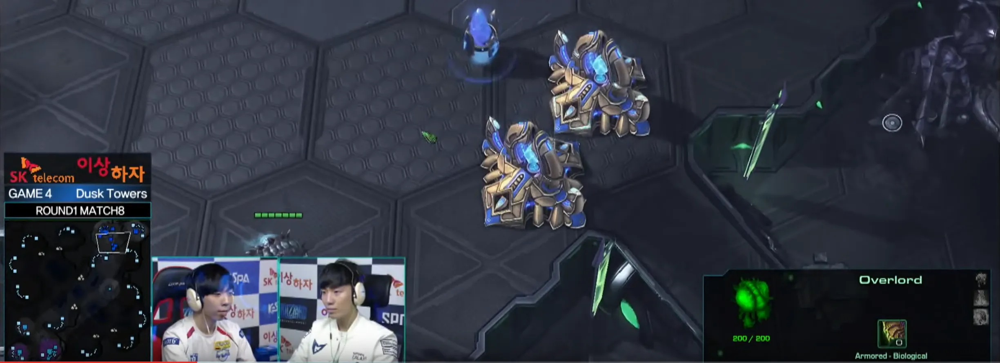
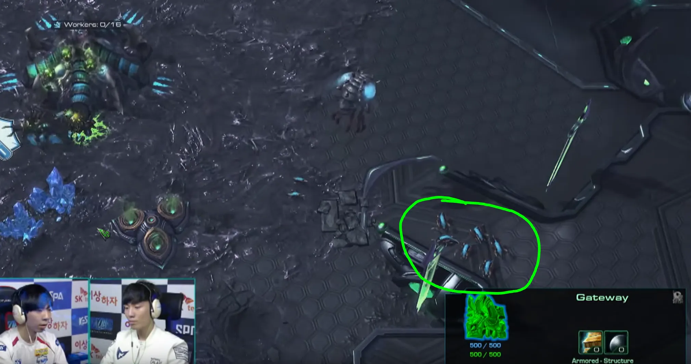
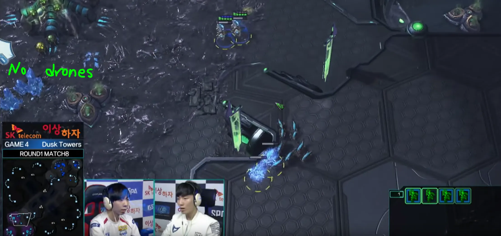
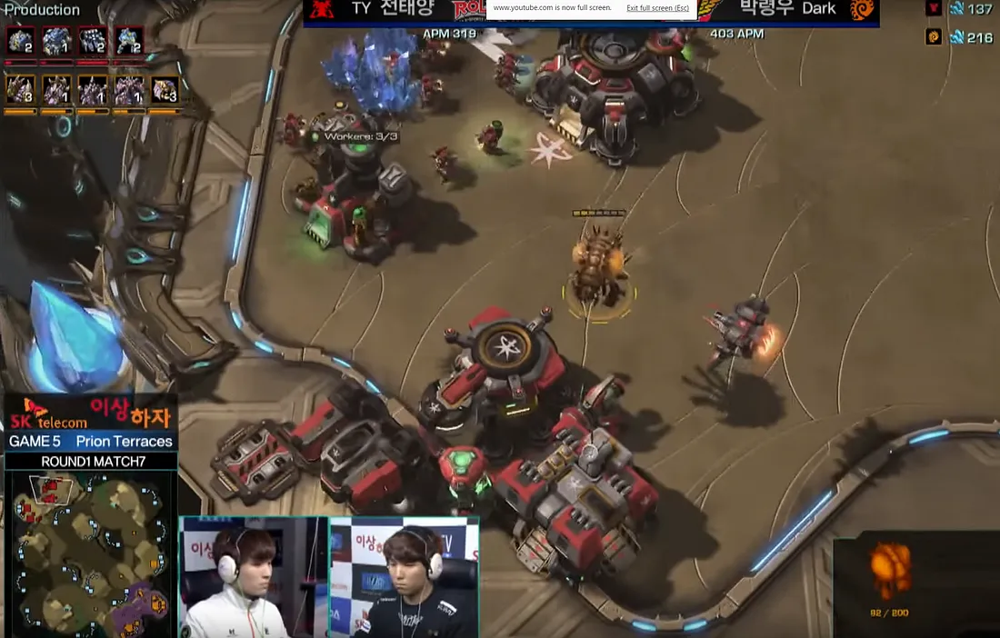
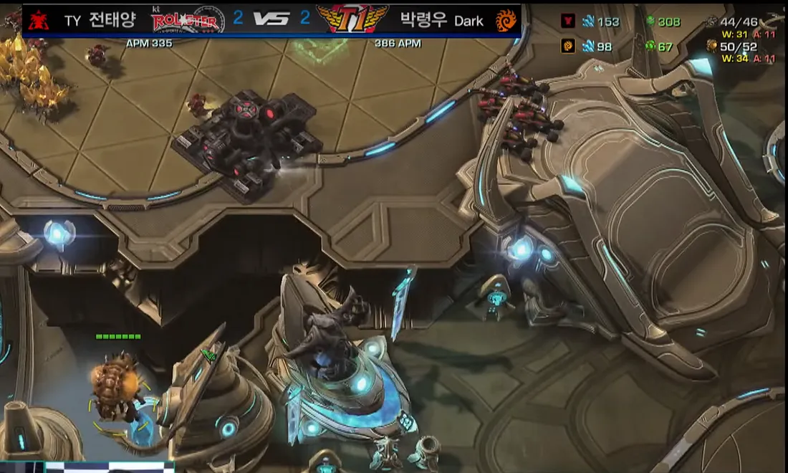

## Summary

In this guide I will be writing about what you, the player, need to be looking out for, the mindset you will need to have, and how to approach different styles when watching Professional Player’s VODs. I am a top Masters Zerg player and this will be completely based on personal experience as I do not think there is a complete set-in-stone way to approach this topic.

Some things that you can always be sure to keep in mind when watching Pro-Player’s VODs are:

1. Everything that the player is doing is for a reason. Right or wrong, they have done that action for a reason so analyze why they chose to build 10 drones at that moment, or why at that moment they are building 16 Zerglings, or why that player decided to move halfway across the map just to turn around, or why that player just threw down 4 Barracks. For every situation, you should be able to find a reason, small or large, as to what made that player think about performing that specific action at that given point in the game. This is key.

2. Keep in mind, that especially for a Zerg player, Build Orders are not everything. Yes, you should have a very specific build order up to a certain point in the game (as shown in my ZvT and ZvZ guide), but this usually doesn’t remain the case past the timing of your spawning pool finishing. After this point the game becomes less of, build 2 gases at 33 supply (although for gas timings this may be the case sometimes), but more about having a specific reaction for everything. For example, if I see my opponent going for Gas before Rax and then another Gas immediately following the Rax, one of the major possibilities based solely on that observation would be a Cloak Banshee opening and you should have a specific reaction for this opening. This could be a number of things and that is where people start to vary stylistically as Zerg players in my opinion. You may choose to put 2 spores at each base, while another player may choose to rush lair and build ~4 queens. All in all, as long as you are learning these stylistic choices from Professional VODs you should be headed down the path of improvement.

3. Always pay attention to the in game timer, the drone/probe/scv count, and the variations of plays between different VODs of the same players and different players. As stated above, there is a rhyme and reason for everything.

4. Watch the minimap. This is one of the most important things you, as the viewer, can do because it gives you the ability to see more than what you can see with an in game obs. When watching the minimap some things you will want to look out for are Overlord placements around the opponents base, what time you want to poke in their base with your Overlords, depending on what that Overlord sees how the Zerg reacts, Overlord spread across the map, and lastly Army movement. You would be surprised at how active many of the Korean Zerg players are with their army compared to normal players like you and I.

In the next section, I will walk through a couple of VODs from GSL or SSL and go over some specifics of how to implement what you just read above.

## Example 1) DeParture vs Hurricane (Proleague Dusk Towers)

[VOD](https://www.youtube.com/watch?v=uIWnDNdmdSw)

For this example, we will use the time-stamps of the YouTube video since ProLeague has taken out the in game timer from their matches.

Most of the early game things like DeParture’s three Hatch before Pool and the Gas timing are going to happen no matter what. That is what I mean by you should have a build order for the opening of your match, since he does not know what Hurricane is doing yet (no vision of anything) you can make the assumption he planned to open three Hatch before Pool prior to starting this game.

When we reach 4:18 in the video, this is when we can start assuming that everything that DeParture will do from here on out is for a reason because now he scouts the two Gateways in the front (Figure 1). So to look at this screen shot, you absolutely know that this Overlord pathing was completely intentional. With the current meta in Starcraft almost no pro gamer opens with a Stalker so it is rather safe to fly the Overlord straight to the Gateways every time.

Right off the bat, seeing the 2 Gateways completely eliminates the idea of a quick proxy Gateway rush so DeParture immediately starts his 3 Queens knowing he can do so safely.

Things get a little weird around 4:40 when we see DeParture build 10 Zerglings. Normally most players when watching this VOD would not think anything of this because they don’t know what to look for, but remember, DeParture plays this game for 10+ hours a day. He knows what he is doing. These 10 Zerglings are a direct reaction to seeing the 2 Gateways being chronoed. This means that Hurricane will pressure with at least tDeParture has no Drones at the 3rd and has his Lings in the correct position.
wo adepts. So when you are playing against a Protoss player next time and you see this exact opening from them, you know EXACTLY how you should respond.

Again, when you are watching VODs in order to improve you should be paying attention to every little detail that goes on in this game. For example, at 4:57 we see that DeParture has rallied his 10 Zerglings to his ramp. Is this an accident? No! Is this where he naturally sets the rally for all of his Hatcheries? I highly doubt it. He is doing this for a reason, now it is our job to determine that reason and learn from it. As you can see in Figure 2, his Lings are starting to pile up on his ramp as the Adepts are about half way across the map. My assumption is that if he were to position his Zerglings towards the front of his third base then the Adept could just shade right past his Zerglings and he would end up spending the next 1–2 minutes chasing down the Adpets while they target drones. This is bad and if DeParture did this he probably would not be as good as he is today.

Now that we understand that he is not placing his Lings there by accident and why he is doing that, let’s look at the different options that the Protoss has when he sees this positioning. In Figure 3, at 5:15, we can see that because of this positioning, his Lings do not take any damage and they are able to follow the Shades in such a way that if Hurricane let his Shades finish, they would be immediately surrounded by the Zerglings which would give DeParture a huge advantage.

By having no Drones at the 3rd base and having his Lings in the correct position the absolute worst case scenario is that Hurricane cancels the shade and DeParture loses nothing. Best case scenario would be that Hurricane let the Shades finish, and then DeParture surrounds and kills the Shades putting Hurricane far behind in the early game.

What we can see here is on the surface DeParture rallies his Zerglings to the ramp. End of story. Most of the time players would never even realize that this is happening or that he just happened to accidentally send them to the ramp and that’s it. Obviously we can see (and you could see a similar trend in other games) that this is completely intentional. This is one example in a very long game that shows that even the smallest things we normally don’t spend too much time thinking about could be something that you could be implementing in order to improve your game. So by understanding that something so small could actually be something that separates how you defend an Adept opening to how DeParture defends an Adept opening will really show you how much you may miss when you are watching replays.

## Example 2) TY vs Dark (Proleague ACE Match Prion Terraces)

[VOD](https://www.youtube.com/watch?v=0tchj1xnir8)

The previous example showed a little bit about the point that everything that the Pro Player does is for a reason while it also talks a little bit about reactions. This example will be a bit more focus about having a reaction to everything.

The first time watching this VOD most players would think that Dark went into this game with this build (Nydus timing) planned, and that he had prepped this build specifically for TY on this map. While this is certainly possible I do not think it is very likely. Most of the ‘pre-planned’ builds are builds that will be executed before the game really gets going like we saw in soO vs TY. soO went for a gas first baneling all in that kind of gambled with the way that TY scouted and whether TY would go for an SCV scout before building the Reaper. This build I can guarantee was planned way before he stepped into the booth and was not a reaction to anything other than maybe the map and TY’s habit of scouting in other games.

In this game I won’t be going over the build order or anything leading up to the Nydus play except for the reasoning behind why he took that and what you, as the observer, should be looking for when watching these replays in order to determine the reasoning behind his decision making so you can implement it into your games.

Leading up to about 5:30 into the Youtube Video timer we see a pretty standard opening from Dark. Since the natural has gold mineral patches he left Drones on gas in order to get his usual Overlord Speed to maximize his scouting. He gets his Lair at a pretty normal time, and gets his gases at about 2 base saturation. Nothing out of the ordinary here.

At 5:30 (Youtube Time) (Figure 4) Dark sends an Overlord with Speed into the main and sees that TY has started a rather quick 3rd CC with his other Overlord at the natural (Figure 5). With the Overlord that flies into the main Dark sees that he has 1 Starport (with a tech lab), 1 Barracks (not getting any upgrades), and 1 add-on-less Factory. This is not a strong production line and with so few units (a couple Marines, a couple Hellions, and one Viking) while taking a 3rd I believe it is this point in time that Dark decides to follow up with the Nydus timing.

## Conclusion

When watching VODs and trying to learn, it is these important things to look out for. I feel like most inexperienced players will blindly watch matches and assume they will automatically learn from them without putting in any additional thought and I think this frustrates a lot of players when they want to improve. Hopefully this guide can give a much clearer understanding as to what you need to pay attention to when you watch higher level games.
