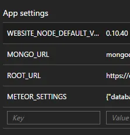
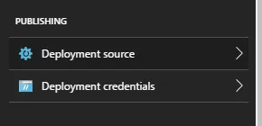

## Azure-Demeteorizer

[GitHub Repository](https://github.com/christopheranderson/azure-demeteorizer)

### Prerequisites

- Install Meteor locally (version must be higher than 0.8.1 and lower than 1.3)
- Download nvm and switch the Node version to 0.10.40 32-bit
- Mongo accessibility through MongoDB on a VM or Mongo Lab
- Application Settings (on Azure) and set the following App settings

```sh
WEBSITE_NODE_DEFAULT_VERSION: 0.10.40
ROOT_URL: http://<sitename>.azurewebsites.net
MONGO_URL: <insertMongoURLfromMongoLabHere>
```



- Python 2.7 (which is required for node-gyp)
- Microsoft Visual C++ Redistributable (2012 worked for me)
- Set up the Azure Web App’s deployment credentials & source (Local Git Repo)



If you are on windows make sure you check this out. If you are using a Meteor Settings file, you can set this as an App Setting as described above.

### Deployment

- Stop your Web App (if redeploying, reset the publish profile in the `…more` settings as well)
- Navigate to your Meteor App directory
- run the following commands individually

```js
//Precheck all of the prerequisites
azure-demeteorizer build

//Where most of the errors will occur. Sometimes will show some
//error looking output but will still work
azure-demeteorizer install

//Zips the bundle folder located in the newly created .demeteorized/
azure-demeteorizer zip

//This deploys that ziped bundle folder to the Web App
azure-demeteorizer deploy -s <sitename> -u <username> -p <password>
```

The username and password are going to be from settings your web app credentials on Azure.

To get a more extensive output when deploying add ` — loglevel silly` on the end of the deployment command.

After this your web app should be deployed and should be now running on your Azure Web App!

### Common Errors

Many of these were solved through the issues on the GitHub page or by finding other guides.

#### HTTP 500 during deployment

Fibers is locked by the node process still running on your web app. Make sure you have stopped your Web App.

#### Fibers@1.0.5 install: `node ./build.js` — Exit Status 1 Failed at the fibers@1.0.5 install script:

This is an issue with some of the prerequisites not being met or being installed/used incorrectly. I solved this issue by adding nvm/v0.10.40/ to my local machine’s path and running `npm install — msvs_version=2012` (with a space in between the install and dashes).

#### Getting `non 200 status code` during deployment:

This is an issue with using an incorrect Meteor version on windows and the path being too long. This is a known issue for 1.3.x< versions of meteor and can be solved by downgrading the application to 1.2 or lower.

#### Redirect Loop when accessing the web app

This is caused by using the package `force-ssl`. If you need to force ssl you should set it up through the Azure Web App itself instead of through the Meteor Package or through a .config file.

## Azure Active Directory

[GitHub Repository](https://github.com/djluck/accounts-azure-active-directory)

### Setup

- Follow the instructions listed here.
- Use the accounts-ui package to get it up and running quickly. Use

```js
{{> login buttons}}
```

- Click `configure Azure AD` and enter the Client ID, Secret Key, and Tenant ID from where you set up Active Directory. (Make sure you add the Reply URLs suggested when clicking this button).

### Common Issues

#### Resetting the ClientID, Secret, and/or Tenant ID

Meteor will store these values (hidden from Mini Mongo) in the MongoDB as seperate collections. In order to reset these on your local machine run:

```js
//Local Machine
meteor reset
```

To reset these on a deployed app, delete the collection containing these in your Mongo Database. The collection should be called `meteor_accounts_loginServiceConfiguration`

#### 404 when entering the credentials where the url looks something like: https://azurewebapp.net/_oauth/azureAd?code=<insertcodehere>…

When deploying a NodeJS application (which is done through the steps above) urls are going to be limited to a maximum of 1024 characters. Sometimes (sometimes not) the authentication token sent to your application to verify the Active Directory login will exceed the limit. The most difficult part about this is the diagnoses since all it shows is a 404 error. To solve this you need to go to the Kudu console found on your Azure Web App in Tools>Kudu>Go. Then click on the debug console and go to site>wwwroot>web.config (scroll down). Click on the pencil to edit, and then search for the `<requestFiltering>` tag. Inside this tag but not inside the next tag add the line `<requestLimits maxQueryString=“20000”/>`. Save this file and then you should be able to login successfully.

This above error was my motivation to write this blog. Hopefully this will save people the struggle in the future. I did not create most of this content, rather reorganized and combined a lot of information I have found from various place.
